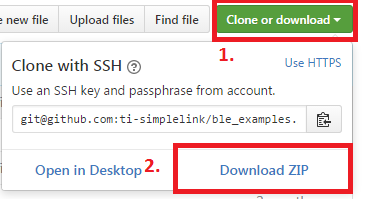

Extra examples for TI BLE-Stack SDK
===================================

This repository contains additional sample applications and components for the Texas Instruments *Bluetooth&reg;* Low Energy software development kit. All Github sample apps are compatible with  the latest BLE-Stack SDK.

To use the examples and tools in this repository, please [download and install the SDK](http://www.ti.com/ble-stack) first, and if necessary [buy an evaluation kit](https://store.ti.com/Search.aspx?k=CC2650).

For other hardware and software resources, [please visit our wiki](http://www.ti.com/ble-wiki). If you have any questions please refer to the [FAQ page](docs/faq.md).

**Note:** Not all additional sample projects are migrated to GitHub - please refer to the Examples List below.

Installation
============

This repository can be cloned and tracked using Git. For instructions on how to clone a repository from Github please refer to this guide: [Clone from Github](https://help.github.com/articles/cloning-a-repository/)

For users who are unfamiliar with Git, there is the option of downloading the contents of the repository as a zip file. See instructions below.

    - Click the green "Clone or download" button
    - Select "Download ZIP" option
    - Zip folder will appear in your Downloads folder

&nbsp;&nbsp;&nbsp;&nbsp;

This repository can be cloned/download anywhere on your computer. There is a dependency between this repository and the BLE SDK install location.

By default the BLE SDK will install to:

        C:\ti\simplelink\ble_sdk_2_02_00_31

If the BLE SDK must be installed to a different location, then the examples in this repo will need to have the following environment variable updated

        TI_BLE_SDK_BASE

Follow your IDE specific instructions for changing environment variables or simply do a global search and replace within the ble\_examples folder. See the [FAQ page](docs/faq.md) for more details.

By default, TI\_BLE\_SDK\_BASE points to C:\ti\simplelink\ble\_sdk\_2\_02\_00\_31. If you installed the SDK there, no change is required.

Required Tools
==============

Similar to the BLE-Stack SDK, the examples in this repository support the IAR and CCS toolchains. Please pay careful attention to versions of these tools, the supported version are listed below. Using a non supported version is untested and may result in unexpected behavior.

 - IAR for ARM v7.50.3
 - CCS v6.1.3 with TI ARM Compiler v5.6.7

For more information on toolchain setup, please refer to our [FAQ page](docs/faq.md).

FAQ
===

The [FAQ page](docs/faq.md) will try to address some of the common questions related to the ble_examples repo.

Examples List
=============

The following examples are currently supported:

### beacon\_rfdriver
&nbsp;&nbsp;&nbsp;&nbsp;Send BLE advertisements directly using the RF driver

&nbsp;&nbsp;&nbsp;&nbsp;[docs](docs/beacon_rfdriver.md) | [Launchpad project files](examples/cc2650lp/beacon_rfdriver) | [src](src/examples/beacon_rfdriver)

### hid\_adv\_remote\_privacy
&nbsp;&nbsp;&nbsp;&nbsp;Taking the BLE SDK HID advanced remote example and enableing Privacy 1.2

&nbsp;&nbsp;&nbsp;&nbsp;[docs](docs/hid_adv_remote_privacy.md) | [CC2650RC project files](examples/cc2650rc/hid_adv_remote_privacy) | [src](src/examples/hid_adv_remote_privacy)

### hid\_emu\_kbd
&nbsp;&nbsp;&nbsp;&nbsp;Emulate emulate a HID keyboard using the LaunchPad

&nbsp;&nbsp;&nbsp;&nbsp;[docs](docs/hid_emu_kbd.md) | [Launchpad project files](examples/cc2650lp/hid_emu_kbd) | [src](src/examples/hid_emu_kbd)

### multi\_role
&nbsp;&nbsp;&nbsp;&nbsp;Implement multiple GAP roles on a single device. Note there are both LaunchPad and EM versions of this demo.

&nbsp;&nbsp;&nbsp;&nbsp;[EM docs](docs/multi_role.md) | [LaunchPad docs](docs/multi_role_lp.md) | [EM project files](examples/cc2650em/multi_role) | [LP project files](examples/cc2650lp/multi_role) | [src](src/examples/multi_role)

### security\_examples
&nbsp;&nbsp;&nbsp;&nbsp;Demonstrate BLE 4.2 Security Features on CC2650

&nbsp;&nbsp;&nbsp;&nbsp;[docs](docs/security_examples.md) | [EM central project files](examples/cc2650em/security_examples_central) | [EM peripheral project files](examples/cc2650em/security_examples_peripheral) | [central src](src/examples/security_examples_central) | [peripheral src](src/examples/security_examples_central)

### simple\_central\_audio\_receiver
&nbsp;&nbsp;&nbsp;&nbsp;Receive and decode a voice stream over BLE using CC2650 central device and SensorTag or  
&nbsp;&nbsp;&nbsp;&nbsp;HID Advanced Remote peripheral device

&nbsp;&nbsp;&nbsp;&nbsp;[docs](docs/simple_central_audio_receiver.md) | [Launchpad project files](examples/cc2650lp/simple_central_audio_receiver) | [src](src/examples/simple_central_audio_receiver)

### simple\_peripheral\_observer
&nbsp;&nbsp;&nbsp;&nbsp;Demo Peripheral and observer roles on CC2650

&nbsp;&nbsp;&nbsp;&nbsp;[docs](docs/simple_peripheral_observer.md) | [Launchpad project files](examples/cc2650lp/simple_peripheral_observer) | [src](src/examples/simple_peripheral_observer)

### spp\_over\_ble
&nbsp;&nbsp;&nbsp;&nbsp;Send bidirectional UART data over BLE, similar to Serial Port Profile (SPP) in Bluetooth Classic

&nbsp;&nbsp;&nbsp;&nbsp;[docs](docs/spp_ble.md)  | [Launchpad client project files](examples/cc2650lp/spp_ble_client) | [Launchpad server project files](examples/cc2650lp/spp_ble_server) | [client src](src/examples/spp_ble_client) | [server src](src/examples/spp_ble_server)

### throughput\_example
&nbsp;&nbsp;&nbsp;&nbsp;Demonstrate the maximum theoretical throughput of a BLE link using the 2x CC2650 devices.  
&nbsp;&nbsp;&nbsp;&nbsp;These projects include a demo of 4.2 Data Length Extension, which improves throughput.

&nbsp;&nbsp;&nbsp;&nbsp;[docs](docs/throughput_example.md) | [EM central project files](examples/cc2650em/throughput_example_central) | [EM peripheral project files](examples/cc2650em/throughput_example_peripheral) | [launchpad central project files](examples/cc2650lp/throughput_example_central)  
&nbsp;&nbsp;&nbsp;&nbsp;[launchpad peripheral project files](examples/cc2650lp/throughput_example_peripheral) | [central src](src/examples/throughput_example_central) | [peripheral src](src/examples/throughput_example_peripheral)

### serial\_bootloader
&nbsp;&nbsp;&nbsp;&nbsp;Show implementation of the ROM Bootloader running from Flash memory.  
&nbsp;&nbsp;&nbsp;&nbsp;[docs](docs/serial_bootloader.md) | [Project files](examples/util/serial_bootloader) | [src](src/util/serial_bootloader)

References
==========

The following reference pages may be helpful during general BLE development. New users of the CC26xx platform and BLE are encouraged to read the [Software Developer's Guide](http://ti.com/lit/pdf/swru393) and complete the [SimpleLink Academy](http://software-dl.ti.com/lprf/simplelink_academy/overview.html) training.

Other resources can be found below:

* [BLE wiki](http://www.ti.com/ble-wiki)
* [BLE E2E Page](www.ti.com/ble-forum)