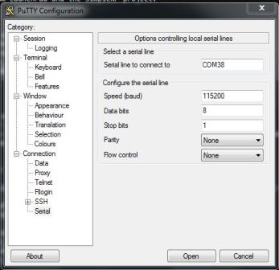

## Frequently Asked Questions

* [What if I installed the SimpleLink CC2640R2 SDK at a non default location (e.g. Not at ``C:\ti\simplelink_cc2640r2_sdk_2_20_00_49``)?](#default)
* [Why am I getting an error when I am trying to run a Python script from the /tools folder?](#python)
* [How can I setup my toolchain for use with the ble\_examples repo?](#toolchain)
* [I am using a LaunchPad device, how can I view display data?](#display)
---

### What if I installed the SimpleLink CC2640R2 SDK at a non default location (e.g. Not at ``C:\ti\simplelink_cc2640r2_sdk_2_20_00_49``)?

All projects reference files from the BLE stack using environment variables, you
can change this in your IDE's project files.

**CCS**

No changes to the project is necessary. You just need to ensure that Code
Composer Studio was able to discover the SimpleLink CC2640R2 SDK in the
available *RTSC Products* tab. See the
[BLE-Stack for Bluetooth 4.2 User's Guide](http://dev.ti.com/tirex/#/?link=Software%2FSimpleLink%20CC2640R2%20SDK%2FDocuments%2FBLE-Stack%2FBLE-Stack%20User's%20Guide)
for more details.

**IAR**

1. Navigate to the sample project directory within the repo and open the
   `.custom_argvars` file.
1. Update the value of ``SIMPLELINK_CORE_SDK_INSTALL_DIR`` to point to your
   custom installation directory where you installed the SimpleLink CC2640R2 SDK.

---
### How should I keep my application based on a TI BLE-Stack SDK under version control?

There are many ways to solve and address this issue. We are merely presenting
one suggested workflow out of the many combinations that exist.

Since this is an advanced topic, it has its own page dedicated to it.
You can read more here: [Version Control](suggested_workflow.md)

---

### Why am I getting an error when I am trying to run a Python script from the /tools folder?

Likely your Python environment is not installed correctly. Please check the
following debug steps:

1. All scripts in the tools folder use Python 2.7, ensure that you have this
   version installed to `C:\Python27`
1. Python scripts can be invoked using `python <script_name>.py` this requires
   adding Python to your environment variables.
   * Add ``C:\Python27`` to the `PATH` variable within your Windows environment
     variables, see
     [windows env vars](https://www.java.com/en/download/help/path.xml) for more
     info.
1. If you can run the script successfully but get a runtime error, you likely
   don't have the necessary python modules installed.
  * Python modules can be found by looking at the `import` statements at the top
    of the `.py` file. You can install Python modules using the Python package
    manager, pip.
  - Install Pip by following
    [these steps](http://stackoverflow.com/questions/4750806/how-do-i-install-pip-on-windows).
    The section "Python 2 ≤ 2.7.8 and Python 3 ≤ 3.3" will be most helpful.

---

### How can I setup my toolchain for use with the ble\_examples repo?

**CCS**

For BLE-Stack examples, see the *Developing with CCS* section of the
[BLE-Stack for Bluetooth 4.2 User's Guide](http://dev.ti.com/tirex/#/?link=Software%2FSimpleLink%20CC2640R2%20SDK%2FDocuments%2FBLE-Stack%2FBLE-Stack%20User's%20Guide).
**IAR**

For BLE-Stack examples, see the *Developing with IAR* section of the
[BLE-Stack for Bluetooth 4.2 User's Guide](http://dev.ti.com/tirex/#/?link=Software%2FSimpleLink%20CC2640R2%20SDK%2FDocuments%2FBLE-Stack%2FBLE-Stack%20User's%20Guide).

---

### I am using a LaunchPad device, how can I view display data?
LaunchPad projects are already set up to use the tidriver Display. For more
information about the Display driver please see the Display.h driver
documentation in the Simplelink CC2640R2 SDK (`docs/tidrivers/tidriversAPI.html`)

To setup your PC to receive this data please follow the steps below:

1. Install PuTTY or another serial terminal emulator
1. Use the Windows Device Manager (Start &rarr; Run &rarr; `mmc devmgmt.msc`
    &rarr; Ok) to determine which COM port you should connect to:

    
    * Note the COM port number of the `XDS110 Class Application/User UART` listed.
1. Configure putty as a serial console with 115200 8N1.
1. Fill in the Serial Line field with the COM port from above.
1. When configured correctly, the program should look as below:

| Main Screen                                   | Serial Screen                         |
|:---------------------------------------------:|:-------------------------------------:|
|   |  |

**You may need to unplug/replug your LaunchPad and restart PuTTY if you do not see any output.**
